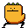
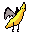
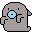
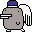

# エッグモン

###  Eggumon is a virtual pet game where you hatch eggs and raise monsters! 

[Link to repository for the backend](https://github.com/ajsultanov/eggumon-backend)

####  Made with:
- JavaScript
- Rails API
- Custom CSS
- Custom pixel art sprites
- Postgres

 Evoking browser games of the '90s and '00s, in Eggumon a user hatches their own (random) monster from an egg. Then they feed, clean up after, and train their pets until they are ready to evolve to the next level, and a new random sprite is generated. 

Click on the egg to hatch.

Food increases happiness and health (but only if your pet is hungry!)  Training increases skill points but decreases happiness, you must find the proper balance.

With enough points your pet can level up.

Be careful not to let health or happiness reach zero!

[code](https://github.com/ajsultanov/eggumon-frontend/blob/master/src/index.js)

[sprites!](https://github.com/ajsultanov/eggumon-frontend/tree/master/src/img)
